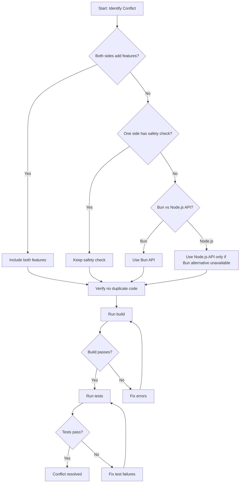

# Merge Conflict Resolution Plan - Complete Guide

## Overview

This document provides a comprehensive resolution strategy for all 99 merge conflict occurrences across 47 files. The goal is to preserve all functionality and upgrades from both HEAD and incoming commit `296250f1b7e1ec992a3a33bee999f5e09a1697d0`.

---

## Conflict Summary by Category

| Category | Files | Conflicts | Priority |
|----------|-------|-----------|----------|
| Theme Files | 2 | 6 | High |
| Core Tools | 10 | 25 | High |
| Filesystem & Config | 4 | 12 | High |
| App Entry Points | 2 | 4 | High |
| Skills & Discovery | 2 | 3 | Medium |
| Auth & Global | 2 | 4 | Medium |
| Session & Agent | 4 | 6 | Medium |
| TUI Components | 3 | 6 | Medium |
| Provider & Models | 1 | 3 | Medium |
| UI Components | 5 | 8 | Medium |
| Test Files | 9 | 15 | Low |
| Misc Files | 3 | 7 | Low |

---

## Resolution Principles

### 1. Bun-First Approach
This project uses Bun as its runtime. Prefer Bun-native APIs:
- `Bun.file(path)` over `fs.promises.readFile(path)`
- `Bun.file(path).exists()` over `existsSync(path)` for async contexts
- `Bun.Glob` over custom glob implementations
- `Bun.write()` over `writeFile()`

### 2. Safety Checks Always Win
HEAD contains important safety checks that must be preserved:
- Directory existence checks before operations
- Null byte sanitization (`\0`, `\\u0000`)
- Path validation against project directory
- File locking for concurrent access (`FileTime.withLock`)

### 3. Both Sides Add Value
When both sides add independent functionality, include both:
- Theme additions (abyss + oc-2)
- Feature additions
- Bug fixes from either side

---

## Detailed File-by-File Resolution

### Phase 1: Theme Files (Priority: HIGH)

#### 1. `packages/ui/src/theme/default-themes.ts`

**Conflict Location:** Lines 3-7, 44-48, 86-90

**HEAD Content:**
```typescript
import abyssThemeJson from "./themes/abyss.json"
export const abyssTheme = abyssThemeJson as DesktopTheme
abyss: abyssTheme,
```

**Incoming Content:**
```typescript
import oc2ThemeJson from "./themes/oc-2.json"
export const oc2Theme = oc2ThemeJson as DesktopTheme
"oc-2": oc2Theme,
```

**Resolution:** Include BOTH themes
```typescript
import abyssThemeJson from "./themes/abyss.json"
import oc2ThemeJson from "./themes/oc-2.json"

export const abyssTheme = abyssThemeJson as DesktopTheme
export const oc2Theme = oc2ThemeJson as DesktopTheme

export const DEFAULT_THEMES: Record<string, DesktopTheme> = {
  "oc-1": oc1Theme,
  abyss: abyssTheme,      // From HEAD
  "oc-2": oc2Theme,       // From incoming
  // ... rest of themes
}
```

#### 2. `packages/ui/src/theme/index.ts`

**Conflict Location:** Lines 34-38

**Resolution:** Export both themes
```typescript
export {
  oc1Theme,
  abyssTheme,   // From HEAD
  oc2Theme,     // From incoming
  // ... other exports
}
```

---

### Phase 2: Core Tools (Priority: HIGH)

#### 3. `packages/opencode/src/tool/read.ts`

**Conflict Locations:** Lines 2-5, 17-34, 65-81, 136-144, 166-191, 197-225, 251-254, 283-300+

**Analysis:**
- HEAD uses `Bun.file()` for file operations, imports `TOOL` constants
- Incoming uses Node.js `createReadStream`, `readline` for streaming, defines local constants

**Resolution Strategy:**
1. Keep HEAD's Bun-based approach (more idiomatic for this project)
2. Import `TOOL` constants from `"../constants"`
3. Use `Filesystem.mimeType()` for MIME detection (from incoming)
4. Keep streaming approach from HEAD using `Bun.file().text()`

**Resolved Code Pattern:**
```typescript
import z from "zod"
import * as fs from "fs/promises"
import * as path from "path"
import { Tool } from "./tool"
import { LSP } from "../lsp"
import { FileTime } from "../file/time"
import { Filesystem } from "../util/filesystem"
import { Instance } from "../project/instance"
import { assertExternalDirectory } from "./external-directory"
import { Identifier } from "../id/id"
import { InstructionPrompt } from "../session/instruction"
import DESCRIPTION from "./read.txt"
import { TOOL } from "../constants"

// Use Bun.file() for existence check
const isBinary = await Filesystem.isBinaryFile(filepath)
if (isBinary) throw new Error(`Cannot read binary file: ${filepath}`)

// Use Bun.file().text() for reading
const file = Bun.file(filepath)
const text = await file.text()
const lines = text.split(/\r?\n/)

// Use TOOL constants
const limit = params.limit ?? TOOL.DEFAULT_READ_LIMIT
const MAX_BYTES = TOOL.MAX_BYTES
```

#### 4. `packages/opencode/src/tool/write.ts`

**Conflict Locations:** Lines 43-52, 68-82

**Analysis:**
- HEAD uses `FileTime.withLock()` for safe concurrent access
- HEAD has directory existence checks
- Incoming uses simpler `Filesystem.write()` approach

**Resolution:** Use HEAD's approach with locking and safety checks
```typescript
return await FileTime.withLock(filepath, async () => {
  // Validate external directory access
  await assertExternalDirectory(ctx, filepath)
  
  // Ensure parent directory exists
  const parentDir = path.dirname(filepath)
  if (!fs.existsSync(parentDir)) {
    fs.mkdirSync(parentDir, { recursive: true })
  }
  
  // Check file existence and read content safely
  const file = Bun.file(filepath)
  const exists = await file.exists()
  const contentOld = exists ? await file.text() : ""
  
  // ... rest of implementation
})
```

#### 5. `packages/opencode/src/tool/edit.ts`

**Conflict Location:** Lines 123-158

**Analysis:**
- HEAD has simpler flow with diff creation
- Incoming has additional handling for empty oldString case

**Resolution:** Combine both - keep HEAD's flow but add incoming's empty string handling
```typescript
await FileTime.withLock(filePath, async () => {
  // Handle empty oldString case from incoming
  if (params.oldString === "") {
    const existed = await Filesystem.exists(filePath)
    contentNew = params.newString
    diff = trimDiff(createTwoFilesPatch(filePath, filePath, contentOld, contentNew))
    // ... permission and write logic
    return
  }
  
  // Normal flow from HEAD
  diff = trimDiff(
    createTwoFilesPatch(filePath, filePath, normalizeLineEndings(contentOld), normalizeLineEndings(contentNew)),
  )
  // ... rest of implementation
})
```

#### 6. `packages/opencode/src/tool/bash.ts`

**Conflict Location:** Lines 318-346

**Analysis:**
- HEAD has Windows environment variable handling (`baseEnv`)
- Incoming has plugin trigger for shell environment

**Resolution:** Include both features
```typescript
// HEAD's baseEnv with Windows handling
const baseEnv = iife(() => {
  const initial = { ...process.env }
  if (process.platform !== "win32") return initial
  return Object.entries(initial).reduce((acc, [key, value]) => {
    const newKey = key.toUpperCase()
    const newValue = value ? value.replace(/%([^%]+)%/g, (_, name) => {
      const val = initial[name] || initial[name.toUpperCase()]
      return val !== undefined ? val : `%${name}%`
    }) : value
    if (newValue === undefined) return acc
    return { ...acc, [newKey]: newValue }
  }, {} as Record<string, string>)
})

// Incoming's plugin trigger
const shellEnv = await Plugin.trigger(
  "shell.env",
  { cwd, sessionID: ctx.sessionID, callID: ctx.callID },
  { env: {} },
)

// Merge both
const mergedEnv = { ...baseEnv, ...shellEnv.env }
```

#### 7. `packages/opencode/src/tool/grep.ts`

**Conflict Location:** Lines 149-160

**Resolution:** Keep HEAD's approach with Bun.Glob

#### 8. `packages/opencode/src/tool/lsp.ts`

**Conflict Location:** Lines 53-55

**Resolution:** Keep HEAD's file existence check with Bun.file()

#### 9. `packages/opencode/src/tool/truncation.ts`

**Conflict Locations:** Lines 8-9, 43-50, 169-175

**Resolution:** Use Bun.Glob from HEAD, keep logging from both sides

#### 10. `packages/opencode/src/tool/registry.ts`

**Conflict Location:** Lines 36-40

**Resolution:** Use Bun.Glob pattern from HEAD

#### 11. `packages/opencode/src/tool/webfetch.ts`

**Conflict Location:** Lines 6-8

**Resolution:** Keep Identifier import from HEAD

#### 12. `packages/opencode/src/tool/batch.ts`

**Conflict Location:** Lines 160-165

**Resolution:** Keep callID from HEAD

---

### Phase 3: Filesystem & Config (Priority: HIGH)

#### 13. `packages/opencode/src/util/filesystem.ts`

**Conflict Locations:** Lines 5-50, 145-200, 385-420, 404-410

**Analysis:**
- HEAD uses Bun APIs with path utilities from `@opencode-ai/util/path`
- Incoming uses Node.js fs APIs with more utility functions

**Resolution:** Merge both implementations
```typescript
import { chmod, mkdir, readFile, writeFile } from "fs/promises"
import { createWriteStream, existsSync, statSync } from "fs"
import { lookup } from "mime-types"
import { realpathSync } from "fs"
import path, { 
  dirname as pathDirname, 
  join as pathJoin, 
  relative as pathRelative, 
  isAbsolute as pathIsAbsolute, 
  resolve as pathResolve, 
  normalize as pathNormalize 
} from "path"
import { Flag } from "@/flag/flag"
import { normalize as _normalize } from "@opencode-ai/util/path"

export namespace Filesystem {
  export const normalize = _normalize
  
  // Bun-optimized exists check
  export const exists = (p: string) =>
    Bun.file(p)
      .stat()
      .then(() => true)
      .catch(() => false)

  // Sync version for metadata checks (from incoming)
  export function stat(p: string): ReturnType<typeof statSync> | undefined {
    return statSync(p, { throwIfNoEntry: false }) ?? undefined
  }

  // Include all utility functions from both sides
  export async function readText(p: string): Promise<string> {
    return Bun.file(p).text()
  }

  export async function readJson<T = any>(p: string): Promise<T> {
    return Bun.file(p).json()
  }

  export async function write(p: string, content: string | Buffer | Uint8Array, mode?: number): Promise<void> {
    // Ensure parent directory exists (from HEAD)
    const dir = path.dirname(p)
    if (!existsSync(dir)) {
      await mkdir(dir, { recursive: true })
    }
    await Bun.write(p, content)
  }
  
  // ... rest of merged implementation
}
```

#### 14. `packages/opencode/src/file/index.ts`

**Conflict Location:** Lines 485-490

**Resolution:** Keep HEAD's implementation with Bun APIs

#### 15. `packages/opencode/src/file/time.ts`

**Conflict Location:** Lines 64-70

**Resolution:** Keep HEAD's normalized path handling

#### 16. `packages/opencode/src/config/config.ts`

**Conflict Locations:** Lines 307-320, 325-343, 414-441, 502-510, 565-575, 635-650, 1426-1430, 1449-1460, 1548-1565

**Analysis:**
- HEAD has directory existence checks before writing
- HEAD uses `Bun.file().json()` for reading
- Incoming uses `Filesystem.readJson()` and `Filesystem.write()`

**Resolution:** Combine safety checks from HEAD with utility functions
```typescript
async function installDependencies(dir: string) {
  using _ = await Lock.write("config-install-" + dir)
  const pkg = path.join(dir, "package.json")
  const targetVersion = Installation.isLocal() ? "*" : Installation.VERSION

  // Ensure directory exists before writing (from HEAD)
  if (!fs.existsSync(dir)) {
    fs.mkdirSync(dir, { recursive: true })
  }

  // Use Bun.file().json() for reading (from HEAD)
  const json = await Bun.file(pkg)
    .json()
    .catch(() => ({}))
  
  json.dependencies = {
    ...json.dependencies,
    "@opencode-ai/plugin": targetVersion,
  }

  // Use synchronous write (from HEAD)
  fs.writeFileSync(pkg, JSON.stringify(json, null, 2))

  const gitignore = path.join(dir, ".gitignore")
  const hasGitIgnore = await Bun.file(gitignore).exists()
  if (!hasGitIgnore) {
    fs.writeFileSync(gitignore, ["node_modules", "package.json", "bun.lock", ".gitignore"].join("\n"))
  }
  
  // ... rest of implementation
}
```

---

### Phase 4: App Entry Points (Priority: HIGH)

#### 17. `packages/app/src/entry.tsx`

**Conflict Locations:** Lines 5-11, 118-130, 136-142

**Analysis:**
- HEAD has `AppProviders` component
- Incoming has `AppBaseProviders` + `AppInterface` with `defaultUrl` logic

**Resolution:** Use HEAD's AppProviders with incoming's defaultUrl logic
```typescript
import { AppProviders } from "@/app"
import { Platform, PlatformProvider } from "@/context/platform"

// Incoming's defaultUrl logic
const defaultUrl = iife(() => {
  const lsDefault = readDefaultServerUrl()
  if (lsDefault) return lsDefault
  if (location.hostname.includes("opencode.ai")) return "http://localhost:4096"
  if (import.meta.env.DEV)
    return `http://${import.meta.env.VITE_OPENCODE_SERVER_HOST ?? "localhost"}:${import.meta.env.VITE_OPENCODE_SERVER_PORT ?? "4096"}`
  return location.origin
})

if (root instanceof HTMLElement) {
  const server: ServerConnection.Http = { type: "http", http: { url: defaultUrl } }
  render(
    () => (
      <PlatformProvider value={platform}>
        <AppProviders />
      </PlatformProvider>
    ),
    root,
  )
}
```

#### 18. `packages/app/src/app.tsx`

**Conflict Location:** Lines 29-35

**Resolution:** Keep HEAD's PromptProvider import

---

### Phase 5: Skills & Discovery (Priority: MEDIUM)

#### 19. `packages/opencode/src/skill/skill.ts`

**Conflict Location:** Lines 123-153

**Analysis:**
- HEAD uses `OPENCODE_SKILL_GLOB.scan()` with Bun.Glob
- Incoming uses `Glob.scan()` utility

**Resolution:** Use Glob utility (consistent with rest of codebase)
```typescript
// Scan .opencode/skill/ directories
for (const dir of await Config.directories()) {
  const matches = await Glob.scan(OPENCODE_SKILL_PATTERN, {
    cwd: dir,
    absolute: true,
    include: "file",
    symlink: true,
  })
  for (const match of matches) {
    await addSkill(match)
  }
}
```

#### 20. `packages/opencode/src/skill/discovery.ts`

**Conflict Location:** Lines 23-31

**Analysis:**
- HEAD uses `Bun.file(dest).exists()` with timeout
- Incoming uses `Filesystem.exists()` without timeout

**Resolution:** Keep HEAD's timeout for robustness
```typescript
async function get(url: string, dest: string): Promise<boolean> {
  if (await Bun.file(dest).exists()) return true
  const controller = new AbortController()
  const id = setTimeout(() => controller.abort(), 10000)
  return fetch(url, { signal: controller.signal })
    .then(async (response) => {
      clearTimeout(id)
      if (!response.ok) {
        log.error("failed to download", { url, status: response.status })
        return false
      }
      if (response.body) await Filesystem.writeStream(dest, response.body)
      return true
    })
    .catch((err) => {
      clearTimeout(id)
      log.error("failed to download", { url, err })
      return false
    })
}
```

---

### Phase 6: Auth & Global (Priority: MEDIUM)

#### 21. `packages/opencode/src/auth/index.ts`

**Conflict Locations:** Lines 48-55, 69-75, 81-87

**Resolution:** Use Bun.file() for reading/writing auth data
```typescript
export async function all(): Promise<Record<string, Info>> {
  const data = await Bun.file(filepath())
    .json()
    .catch(() => ({}))
  return data
}

export async function set(key: string, info: Info) {
  const data = await all()
  await Bun.write(filepath(), JSON.stringify({ ...data, [key]: info }, null, 2))
}
```

#### 22. `packages/opencode/src/global/index.ts`

**Conflict Location:** Lines 5-10, 160-170

**Resolution:** Keep lazy import from HEAD, add cache check from incoming

---

### Phase 7: Session & Agent (Priority: MEDIUM)

#### 23. `packages/opencode/src/session/prompt.ts`

**Conflict Locations:** Lines 1500-1507, 1525-1532

**Analysis:**
- HEAD uses `input.session.slug || "default"` for session slug
- HEAD uses `Bun.file(plan).exists()`
- Incoming uses `Session.plan(input.session)` directly
- Incoming uses `Filesystem.exists(plan)`

**Resolution:** Use HEAD's slug handling with Bun.file().exists()
```typescript
const sessionSlug = input.session.slug || "default"
const plan = Session.plan({ slug: sessionSlug, time: { created: input.session.time.created } })
const exists = await Bun.file(plan).exists()
```

#### 24. `packages/opencode/src/agent/agent.ts`

**Conflict Location:** Lines 54-60

**Resolution:** Keep HEAD's PermissionNext.merge approach

#### 25. `packages/opencode/src/acp/agent.ts`

**Conflict Location:** Lines 198-205

**Resolution:** Keep HEAD's permission queue approach

#### 26. `packages/opencode/src/shell/shell.ts`

**Conflict Location:** Lines 56-65

**Resolution:** Keep HEAD's path array construction

---

### Phase 8: TUI Components (Priority: MEDIUM)

#### 27. `packages/opencode/src/cli/cmd/tui/component/prompt/frecency.tsx`

**Conflict Locations:** Lines 7-10, 61-68, 80-88, 92-98

**Analysis:**
- HEAD uses `Bun.write()`
- Incoming uses `appendFile` from fs/promises

**Resolution:** Use Bun.write consistently
```typescript
import { iife } from "@opencode-ai/util/iife"

// For appending, read existing content first, then write
const content = sorted.map((entry) => JSON.stringify(entry)).join("\n") + "\n"
Bun.write(frecencyFile, content).catch(() => {})
```

#### 28. `packages/opencode/src/cli/cmd/tui/component/prompt/stash.tsx`

**Conflict Locations:** Lines 42-48, 73-80, 97-103, 113-119

**Resolution:** Use Bun.write with writeFile import for appending
```typescript
import { writeFile } from "fs/promises"

// For simple writes
Bun.write(stashFile.name!, content).catch(() => {})

// For appends when needed
writeFile(stashFile.name!, content).catch(() => {})
```

#### 29. `packages/opencode/src/cli/cmd/tui/component/prompt/history.tsx`

**Conflict Locations:** Lines 54-62, 104-112

**Resolution:** Same as frecency.tsx - use Bun.write

---

### Phase 9: Provider & Models (Priority: MEDIUM)

#### 30. `packages/opencode/src/provider/models.ts`

**Conflict Locations:** Lines 92-100, 117-125, 141-148

**Resolution:** Use Bun.file().json() for reading
```typescript
export const Data = lazy(async () => {
  const path = Flag.OPENCODE_MODELS_PATH ?? filepath()
  const result = await Bun.file(path)
    .json()
    .catch(() => {})
  // ... rest of implementation
})

export async function refresh() {
  const file = Bun.file(filepath())
  // ... rest of implementation
}
```

---

### Phase 10: UI Components (Priority: MEDIUM)

#### 31. `packages/ui/src/pierre/index.ts`

**Conflict Location:** Lines 106-115

**Resolution:** Include both CSS selectors from HEAD and incoming

#### 32. `packages/ui/src/components/collapsible.css`

**Conflict Location:** Lines 90-98

**Resolution:** Include both grid-template-rows approaches
```css
&[data-expanded] {
  grid-template-rows: 1fr;  /* From HEAD */
  /* Also include any incoming styles */
}
```

#### 33. `packages/ui/src/components/message-part.tsx`

**Conflict Location:** Lines 1046-1060

**Resolution:** Keep HEAD's displayText function

#### 34. `packages/ui/src/components/session-review.tsx`

**Conflict Location:** Lines 8-15

**Resolution:** Keep HEAD's CSS import

#### 35. `packages/ui/src/components/session-turn.css`

**Conflict Location:** Lines 44-55

**Resolution:** Include both CSS rules

---

### Phase 11: Test Files (Priority: LOW)

#### 36. `packages/opencode/test/snapshot/snapshot.test.ts`

**Conflict Locations:** Lines 11-20, 172-190, 182-190, 483-495

**Resolution:** Merge test setup from both sides, keep HEAD's describe blocks

#### 37. `packages/opencode/test/tool/bash.test.ts`

**Conflict Location:** Lines 410-425

**Resolution:** Keep HEAD's test case

#### 38. `packages/opencode/test/util/filesystem.test.ts`

**Conflict Location:** Lines 1-10

**Resolution:** Keep HEAD's import structure

#### 39. `packages/opencode/test/tool/read.test.ts`

**Conflict Locations:** Lines 456-475, 515-525

**Resolution:** Merge test cases from both sides

#### 40. `packages/opencode/test/tool/truncation.test.ts`

**Conflict Locations:** Lines 5-20, 16-25, 58-70, 175-185

**Resolution:** Merge test setup from both sides

#### 41. `packages/opencode/test/tool/webfetch.test.ts`

**Conflict Location:** Lines 14-22

**Resolution:** Keep HEAD's beforeEach setup

#### 42. `packages/opencode/test/tool/edit.test.ts`

**Conflict Location:** Lines 1-10

**Resolution:** Keep HEAD's import structure

#### 43. `packages/opencode/test/tool/write.test.ts`

**Conflict Location:** Lines 1-10

**Resolution:** Keep HEAD's import structure

#### 44. `packages/opencode/test/config/config.test.ts`

**Conflict Location:** Lines 10-18

**Resolution:** Keep HEAD's os import

---

### Phase 12: Misc Files (Priority: LOW)

#### 45. `.opencode/tool/github-triage.ts`

**Conflict Locations:** Lines 5-15, 602-615, 625-640

**Resolution:** Keep HEAD's fs/path imports and enum validation

#### 46. `packages/opencode/src/cli/cmd/github.ts`

**Conflict Locations:** Lines 949-960, 991-1005

**Resolution:** Keep HEAD's error handling approach

#### 47. `packages/opencode/src/util/log.ts`

**Conflict Location:** Lines 92-110

**Resolution:** Keep HEAD's directory existence check
```typescript
async function cleanup(dir: string) {
  // Ensure the directory exists before scanning (from HEAD)
  await fs.mkdir(dir, { recursive: true }).catch(() => {})
  const glob = new Bun.Glob("*.log")
  const files = await Array.fromAsync(
    glob.scan({
      cwd: dir,
      absolute: true,
    }),
  )
  // ... rest of implementation
}
```

---

## Verification Checklist

After resolving all conflicts, run the following verification steps:

### 1. Build Verification
```bash
# Build all packages
cd packages/opencode && bun run build
cd packages/app && bun run build  
cd packages/ui && bun run build
cd packages/sdk/js && bun run build
```

### 2. Type Check
```bash
bun run typecheck
```

### 3. Lint Check
```bash
bun run lint
```

### 4. Test Verification
```bash
# Run tests from package directories (not from root)
cd packages/opencode && bun test
cd packages/app && bun test
```

### 5. Integration Test
```bash
# Start the application and verify basic functionality
bun run dev
```

---

## Conflict Resolution Flowchart



---

## Summary Statistics

- **Total Files with Conflicts:** 47
- **Total Conflict Markers:** 99
- **Estimated Resolution Time:** 2-4 hours
- **Risk Level:** Medium (core tools have most conflicts)

## Post-Resolution Actions

1. Commit all resolved files with message: `merge: resolve conflicts preserving both HEAD and incoming features`
2. Run full CI/CD pipeline
3. Perform manual testing of:
   - File read/write operations
   - Theme switching (abyss and oc-2)
   - Bash command execution
   - Session management
   - Plan mode functionality
